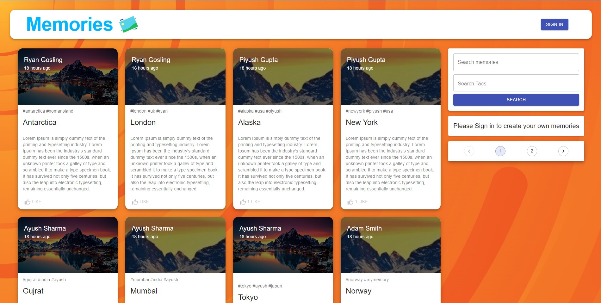
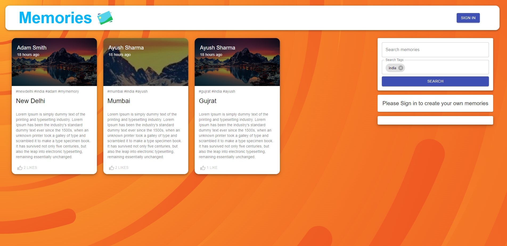
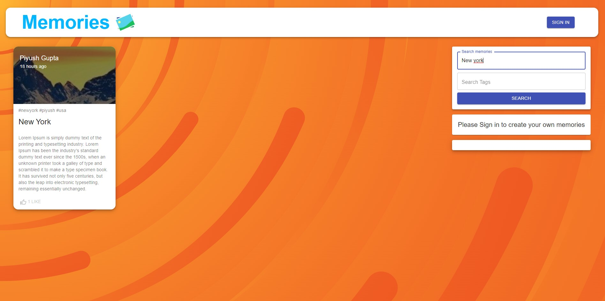
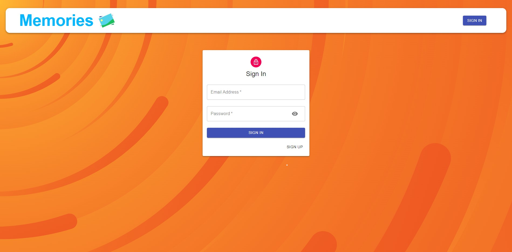
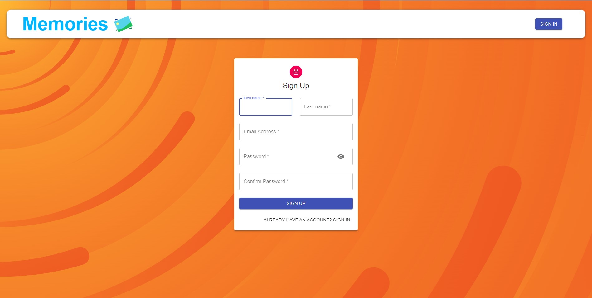
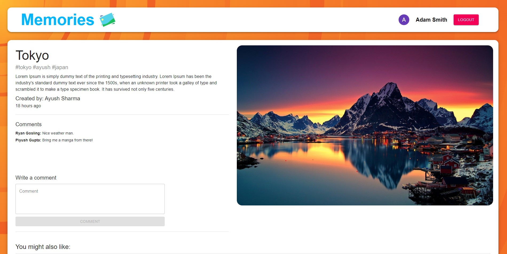
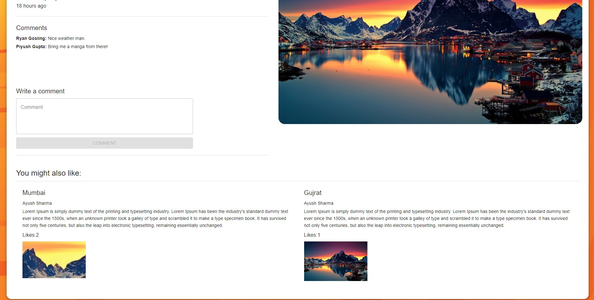

## Memories App with MERN Stack

Memories is a social media app with user authentication features. Memories social media app allows you to share memories,
travel logs, thoughts with other users. Users can like and comment on others post as well. In this application
user can perform (CRUD Operations) read, write, save , update, delete operations.

## Features of My Notes

- Sign Up as User.
- Login and authenticate yourself.
- Create your memory.
- Upload memories/post image.
- Edit your memory.
- Delete your memory.
- Like your and others post.
- Comment on your and others post.
- Search memories/posts by title and tags.
- Create tags for memories/posts.
- Pagination feature.
- Recommended memories/posts.
- Logout and de-authenticate yourself.

## Tools & Technologies Used

#### Client

- React Framework
- Material UI
- Redux & Redux Thunk
- Axios
- React Router
- Jwt-decode
- Moment
- React-file-base64

#### Server

- Node
- Express
- Mongoose
- Multer
- Json Web Token
- Bcrypt
- Cors
- Dotenv

## Environment Variables

To run this project, you will need to add the following environment variables to your .env file

#### Client

- `REACT_APP_API_URI`: Express server REST API Endpoint.

#### Server

- `PORT`: Port of Express server listening to.
- `MONGO_URI`: MongoDB connection URL with database name.
- `JWT_KEY`: JSON web token secret key to sign the data and create token.
- `CLIENT_URI`: Client URL with listening port.

## How to install

#### Client

- CD into client folder and run command `npm install`.
- Create a `.env` file and add client environment variables.
- Run client using command `npm run start`.
- Your client is now running.
- (Optional: if you want to deploy) Run `npm run build` to create static files of the client.

#### Server

- CD into server folder and run command `npm install`.
- Create a `.env` file and add server environment variables.
- Run server using command `npm run start`.
- Your server is now running.

## Screenshots

#### Home page

#### Search By Tags

#### Search By Title

#### Sign In Page

#### Sign Up Page

#### Single Post

#### Recommended Post

